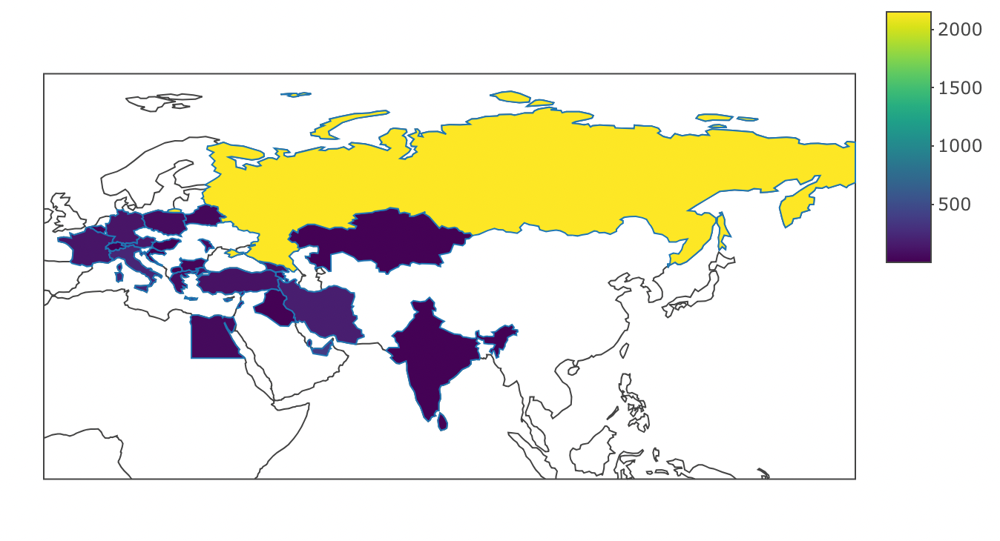
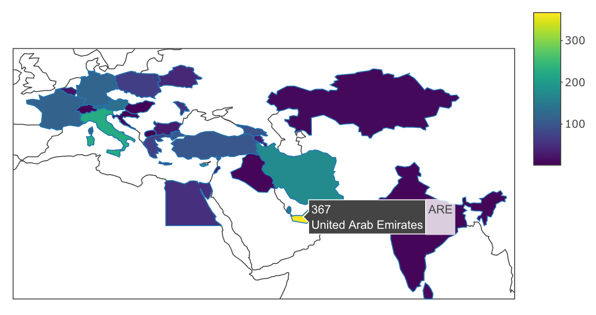
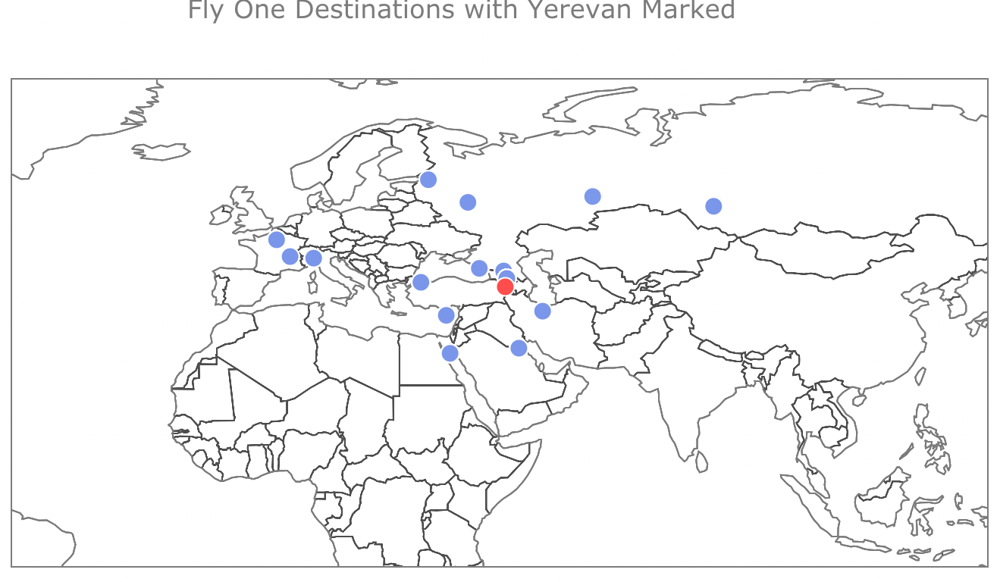

# Flight Pathways and Beyond: Unveiling Zvartnots Airport Data

## Introduction:

This project explores the intricate dynamics of aviation punctuality using a comprehensive dataset from Zvartnots International Airlines, encompassing both departure and arrival details. The objective is to analyze patterns and derive meaningful insights, particularly focusing on the potential correlation between delays and weather conditions.

## Objectives:

We aim to explore the distribution of Zvartnots International Airlines flights across destinations, assess the airline's performance, and analyze temporal patterns based on days of the week and departure times. The hypotheses to be tested include investigating the impact of geographical locations on delays, differences in Zvartnots International Airlines' punctuality, the temporal influence on delays, and the contribution of weather conditions to flight delays.

## Methodology:

The analysis involves exploratory data analysis, statistical testing, and visualization techniques to uncover trends and relationships within the dataset. This study is valuable for various stakeholders within the aviation industry, including airline operators, airport authorities, and policymakers. These insights can inform strategies for improving overall flight efficiency, enhancing airline performance, and ensuring passenger satisfaction. Additionally, researchers and analysts interested in aviation operations and punctuality trends can find this analysis beneficial for academic and industry-related studies.

## Who Can Use and Benefit from This Project:

Airline Operators:
Airlines can leverage the insights gained from this project to optimize their flight schedules, improve punctuality, and enhance overall operational efficiency. By understanding the patterns revealed in the analysis, operators can make informed decisions to minimize delays and improve the overall passenger experience.

Airport Authorities:
Airport management teams can use the findings to better allocate resources, streamline processes, and address specific challenges related to punctuality. This knowledge can contribute to the development of more effective operational strategies, ultimately benefiting both airlines and passengers.

Policymakers:
Policymakers in the aviation industry can utilize the results of this analysis to inform regulations and policies aimed at improving overall system efficiency. By understanding the factors influencing punctuality, policymakers can contribute to the creation of an environment that fosters better on-time performance.

Passengers:
Travelers stand to benefit from this project as it provides insights into potential delays and their causes. Armed with this information, passengers can make more informed decisions about their travel plans, including choosing optimal departure times and considering alternative routes during periods of expected delays.

Academic Researchers:
Scholars and researchers specializing in aviation operations, transportation, and data analysis can use the results of this study as a valuable resource for academic purposes. The dataset and methodology employed in this project provide a foundation for further research and analysis within the field.

Industry Analysts:
Professionals and analysts focused on the aviation industry can gain valuable market intelligence from the trends identified in this project. Understanding the correlation between delays and various factors, including weather conditions, can assist analysts in making predictions, identifying potential risks, and recommending strategies for sustained operational excellence.


## Datasets:

The main dataset was systematically gathered over a two-month period by daily web scraping of Zvartnots International Airlines' website. This ongoing data collection approach ensured a comprehensive and up-to-date representation of the airline's departure operations over an extended timeframe. By scraping the website every day for two months, we accumulated a rich dataset that captures the dynamics of daily departures, enabling a thorough analysis of patterns and trends in Zvartnots International Airlines' flight punctuality.

```{r, echo=FALSE, results="hide",fig.height=6, fig.width=12}
library(ggplot2)
library(plotly)
library(countrycode)
library(dplyr)
```


```{r, echo=FALSE, results="hide",fig.height=6, fig.width=12}
flights <- read.csv('flights_data.csv')
country_dataset <- read.csv('worldcities.csv')

```
```{r, echo=FALSE, results="hide",fig.height=6, fig.width=12}
print(head(flights))
print(head(country_dataset))
```
Data Cleaning:

In the data cleaning process, several steps were taken to enhance the quality and utility of the dataset obtained through web scraping of Zvartnots International Airlines' website over a two-month period. Initially, the dataset was merged with a country dataset. A city-country mapping was created to update destination information accurately. The Scheduled column was converted to datetime, and date and time components were extracted into separate columns. An airline mapping was established to add the 'Airline' column. A binary 'Armenian' column was introduced based on Armenian airlines. The 'Date' column was converted to datetime, and a 'DayOfWeek' column was added. The 'Status' column was updated to categorize flights as 'Ontime' or according to specific delay statuses, and duplicate and irrelevant rows were removed. Additionally, specific dates were excluded, and the final dataset was saved as 'merged_data.csv.' These cleaning steps aim to ensure data accuracy, completeness, and relevance for subsequent analysis.

```{r, echo=FALSE, results="hide",fig.height=6, fig.width=12}
# Filter out 'United States' from the country dataset
country_dataset <- country_dataset[country_dataset$country != 'United States', ]

# Columns to drop from the merged data
columns_to_drop <- c('iso2', 'iso3', 'admin_name', 'capital', 'population', 'id', 'city', 'city_ascii', 'iso2', 'iso3')
merged_data <- country_dataset[, !(names(country_dataset) %in% columns_to_drop)]

# Merge flights data with country dataset
merged_data <- merge(flights, country_dataset, by.x = 'Destination', by.y = 'city', all.x = TRUE)

# Fill NA values with "NA"
merged_data[is.na(merged_data)] <- "NA"

# City-country mapping
city_country_mapping <- list(
  Aktau = c('country' = 'Kazakhstan', 'lat' = 43.6588, 'lng' = 51.1975),
  'St.Petersburg' = c('country' = 'Russia', 'lat' = 59.9343, 'lng' = 30.3351),
  'Mineralnye Vody' = c('country' = 'Russia', 'lat' = 44.2095, 'lng' = 43.1053),
  'Nizhny Novgorod' = c('country' = 'Russia', 'lat' = 56.3159, 'lng' = 43.9944),
  Kishinev = c('country' = 'Moldova', 'lat' = 47.0105, 'lng' = 28.8638),
  'Sharm El Sheikh' = c('country' = 'Egypt', 'lat' = 27.9158, 'lng' = 34.3297),
  Zurich = c('country' = 'Switzerland', 'lat' = 47.3769, 'lng' = 8.5417)
)

# Update merged_data based on city-country mapping
for (city in names(city_country_mapping)) {
  mask <- merged_data$Destination == city
  merged_data[mask, c('country', 'lat', 'lng')] <- unlist(city_country_mapping[[city]])
}

# Drop specified columns
columns_to_drop <- c('iso2', 'iso3', 'admin_name', 'capital', 'population', 'id', 'city', 'city_ascii', 'iso2', 'iso3')
merged_data <- merged_data[, !(names(merged_data) %in% columns_to_drop)]

# Print the merged data
write.csv(merged_data, 'merged_data.csv', row.names = FALSE)

# Convert 'Scheduled' to datetime
merged_data$Scheduled <- as.POSIXct(merged_data$Scheduled)

# Extract date and time components into separate columns
merged_data$Date <- as.Date(merged_data$Scheduled)
merged_data$Time <- format(merged_data$Scheduled, format = "%H:%M:%S")
merged_data <- merged_data[, !(names(merged_data) %in% 'Scheduled')]

# Unique flight codes
unique_flight_codes <- unique(substr(merged_data$FlightNumber, 1, 2))

# Create 'FlightNumberDigits' column
merged_data$FlightNumberDigits <- substr(merged_data$FlightNumber, 1, 2)

# Airline mapping
airline_mapping <- c(
  'JI' = 'Armenian Airlines',
  '3F' = 'Fly One',
  'G6' = 'Fly Arna',
  '6A' = 'Armenia Airways',
  '5G' = 'Shirak Avia',
  '5W' = 'Wizz Air',
  'UT' = 'Utair',
  'PG' = 'Pegasus Airlines',
  'DV' = 'Scat Airlines',
  'WZ' = 'Red WIngs',
  'SU' = 'Aeroflot',
  'QR' = 'Qatar Airways',
  'PC' = 'Pegasus Airlines',
  'LO' = 'LOT Polish Airlines',
  'A3' = 'Aegean Airlines',
  'OS' = 'Austrian Airlines',
  'LH' = 'Lufthansa',
  'UA' = 'United Airlines',
  'SM' = 'Air Cairo',
  'ME' = 'Middle East Airlines',
  'FV' = 'Rossiya airlines JSC',
  'G9' = 'Air Arabia',
  'FZ' = 'Flydubai',
  'CY' = 'Cyprus Airways',
  'A4' = 'Azimuth',
  'AX' = 'Trans States Airlines',
  'NG' = 'Lauda Air',
  'CA' = 'Air China',
  'BR' = 'EVA Air',
  'TO' = 'Transavia',
  'W6' = 'Wizz Air',
  'W4' = 'Wizz Air',
  'EN' = 'Enter Air',
  'BT' = 'AirBaltic',
  'AM' = 'AMC Airlines',
  'AF' = 'Air France',
  'DE' = 'Condor',
  'FV' = 'Rossiya Airlines',
  'DL' = 'Delta Airlines',
  'FT' = 'Fly Egypt',
  'B2' = 'Belavia',
  'SN' = 'Brussels Airlines',
  '8D' = 'FitsAir',
  'EW' = 'Eurowings',
  'IR' = 'Iran Airtour'
)

# Add 'AirlineName' column based on the mapping
merged_data$Airline <- airline_mapping[merged_data$FlightNumberDigits]
merged_data$Airline[is.na(merged_data$Airline)] <- 'Charter Flight'
merged_data <- merged_data[, !(names(merged_data) %in% 'FlightNumberDigits')]
write.csv(merged_data, 'merged_data.csv', row.names = FALSE)

# Armenian Airlines list
armenian_airlines <- c('Armenian Airlines', 'Fly One', 'Fly Arna', 'Armenia Airways', 'Shirak Avia')

# Add 'ArmenianOrInternational' column based on Armenian airlines
merged_data$Armenian <- ifelse(merged_data$Airline %in% armenian_airlines, 1, 0)

# Convert 'Date' to datetime
merged_data$Date <- as.Date(merged_data$Date)

# Add 'DayOfWeek' column based on the day of the week
merged_data$DayOfWeek <- weekdays(merged_data$Date)


# Update 'Status' column
merged_data$Status <- ifelse(tolower(merged_data$Delay) == tolower('Departed'), 'Ontime', merged_data$Delay)

merged_data$Status <- ifelse(tolower(merged_data$Delay) %in% tolower('departed'), 'Ontime', merged_data$Delay)


# Number of duplicate rows before
num_duplicates_before <- sum(duplicated(merged_data))
cat(paste("Number of duplicate rows before: ", num_duplicates_before, "\n"))

# Drop duplicates
merged_data <- merged_data[!duplicated(merged_data), ]
merged_data <- merged_data[merged_data$Status != 'Boarding', ]
merged_data <- merged_data[!duplicated(merged_data[c('Destination', 'Date', 'Time')]), ]

dates_to_remove <- c("24.10.23", "03.12.23", "21.11.23", "28.11.23", "Contacttheairline", "19.11.23", "28.10.23")
merged_data <- merged_data[!(merged_data$Status %in% dates_to_remove), ]
unique(merged_data$Status)
write.csv(merged_data, 'merged_data.csv', row.names = FALSE)

```

Now, lets analyze the distribution of flight destinations.


```{r,  echo=FALSE, results="hide",fig.height=6, fig.width=12}


# Plot the distribution of flights across destinations
destination_plot <- ggplot(merged_data, aes(x = Destination)) +
  geom_bar() +
  labs(title = "Distribution of Flights Across Destinations",
       x = "Destination",
       y = "Number of Flights") +
  theme_minimal() +
  theme(axis.text.x = element_text(angle = 45, hjust = 1)) 


# Print the plot
print(destination_plot)

```

It's interesting to note that Moscow has the highest number of flights Zvartnots International Airport serves based on the distribution analysis. This observation suggests a significant air traffic volume between Yerevan and Moscow, possibly reflecting strong demand, economic ties, or cultural connections between the two cities. This finding could have implications for airline operators, airport authorities, and policymakers, as it may guide decisions related to scheduling, capacity planning, and resource allocation.


Now, let's dive into the interactive map to gain insights into the regions that have the most flight connections with Armenia.


```{r, echo=FALSE, results="hide",fig.height=6, fig.width=12}

```

From the interactive map, a noticeable trend emerges with Russia, having the highest number of flights, which is logical as from the previous plot we see that top countries are Russian countries such as Moscow, Sochi, Mineralniye Vody, St. Peterburg. 
This saturates the color scale and makes it challenging to discern variations among other countries. To gain a more nuanced understanding of flight connections, we have to temporarily exclude Russia from the visualization.


```{r, echo=FALSE, results="hide",fig.height=6, fig.width=12}

```

Upon re-examining the map without Russia, we observe a clearer distribution of flights to various countries. It becomes evident that the United Arab Emirates (UAE) is one of the prominent destinations with a substantial number of flights from Zvartnots International Airport. This shift in focus allows us to analyze and highlight regions beyond Russia, providing valuable insights into the diverse flight connections with Armenia.


```{r, echo=FALSE, results="hide",fig.height=6, fig.width=12}
# Load necessary libraries


# # Read the cleaned dataset
# merged_data <- read.csv('merged_data.csv')
# 
# # Aggregate the data to get the count of flights for each country
# country_flight_counts <- aggregate(Destination ~ country, data = merged_data, FUN = length)
# 
# # Map country names to ISO codes for proper matching with plotly world map
# iso_country_codes <- countrycode(country_flight_counts$country, origin = 'country.name', destination = 'iso3c')
# 
# # Create a choropleth map using plotly
# flight_map <- plot_ly(
#   type = 'choropleth',
#   mode = 'markers+text',
#   locations = iso_country_codes,
#   z = country_flight_counts$Destination,
#   text = country_flight_counts$country,
#   colorscale = 'Viridis'
# )
# 
# # Set the layout
# layout <- list(
#   title = 'Flights from Zvartnots International Airport by Country',
#   geo = list(
#     showframe = FALSE,
#     projection = list(type = 'mercator')
#   )
# )
# 
# # Display the map
# flight_map <- flight_map %>% layout(layout)
# flight_map

```

```{r, echo=FALSE, results="hide",fig.height=6, fig.width=12}
# # Load necessary libraries
# 
# 
# # Read the cleaned dataset
# merged_data <- read.csv('merged_data.csv')
# 
# # Exclude Russia from the dataset
# merged_data <- merged_data[merged_data$country != 'Russia', ]
# 
# # Aggregate the data to get the count of flights for each country
# country_flight_counts <- aggregate(Destination ~ country, data = merged_data, FUN = length)
# 
# # Map country names to ISO codes for proper matching with plotly world map
# iso_country_codes <- countrycode(country_flight_counts$country, origin = 'country.name', destination = 'iso3c')
# 
# # Create a binary vector indicating whether each country has flight values
# has_flights <- country_flight_counts$Destination > 0
# 
# # Find the center of the map based on the countries with values
# center_lon <- mean(merged_data$lng[has_flights])
# center_lat <- mean(merged_data$lat[has_flights])
# 
# # Create a choropleth map using plotly
# flight_map <- plot_ly(
#   type = 'choropleth',
#   mode = 'markers+text',
#   locations = iso_country_codes,
#   z = country_flight_counts$Destination,
#   text = country_flight_counts$country,
#   colorscale = 'Viridis',
#   visible = has_flights
# )
# 
# # Set the layout
# layout <- list(
#   title = 'Flights from Zvartnots International Airport by Country (Excluding Russia)',
#   geo = list(
#     showframe = FALSE,
#     projection = list(type = 'mercator'),
#     visible = has_flights,
#     center = list(lon = center_lon, lat = center_lat),
#     lonaxis = list(range = c(center_lon - 10, center_lon + 10)),
#     lataxis = list(range = c(center_lat - 5, center_lat + 5))
#   )
# )
# 
# # Display the map
# flight_map <- flight_map %>% layout(layout)
# flight_map

```

```{r, echo=FALSE, results="hide",fig.height=6, fig.width=12}


# Assuming your data frame is named merged_data

# Calculate the count of flights for each airline
airline_count_data <- merged_data %>%
  group_by(Airline) %>%
  summarise(Count = n())

# Create a bar plot for the number of flights by airline
bar_plot <- ggplot(airline_count_data, aes(x = Airline, y = Count)) +
  geom_bar(stat = "identity") +
  labs(title = "Number of Flights by Airline",
       x = "Airline",
       y = "Number of Flights") +
  theme_minimal() +
  theme(axis.text.x = element_text(angle = 45, hjust = 1))  # Rotate x-axis labels for better visibility

# Print the bar plot
print(bar_plot)

```
Upon analyzing the distribution of flights among different airlines, it is evident that "Fly One," an Armenian airline, stands out with the highest number of flights. 


```{r, echo=FALSE, results="hide",fig.height=6, fig.width=12}

# 
# # Read the cleaned dataset
# merged_data <- read.csv('merged_data.csv')
# 
# # Filter data for flights operated by "Fly One"
# fly_one_data <- merged_data[merged_data$Airline == "Fly One", ]
# 
# # Coordinates for Yerevan (you may need to adjust these based on your data)
# yerevan_lon <- 44.4991
# yerevan_lat <- 40.1792
# 
# # Create a plotly map with custom markers and tooltips
# fly_one_map <- plot_ly() %>%
#   add_trace(
#     type = 'scattergeo',
#     mode = 'markers',
#     lon = fly_one_data$lng,
#     lat = fly_one_data$lat,
#     text = fly_one_data$Destination,
#     marker = list(
#       size = 12,
#       opacity = 0.9,
#       color = 'royalblue',  # You can customize the color
#       line = list(color = 'white', width = 1)  # Marker border
#     )
#   ) %>%
#   add_trace(
#     type = 'scattergeo',
#     mode = 'markers',
#     lon = c(yerevan_lon),
#     lat = c(yerevan_lat),
#     marker = list(
#       size = 12,
#       color = 'red',  # Red color for Yerevan
#       line = list(color = 'white', width = 1)  # Marker border
#     ),
#     text = 'Yerevan'
#   ) %>%
#   layout(
#     geo = list(
#       scope = 'world',
#       showland = FALSE, # Background color
#       showcountries = TRUE,
#       countrycolor = 'black'  # Country borders color
#     ),
#     title = 'Fly One Destinations with Yerevan Marked',
#     showlegend = FALSE
#   )
# 
# # Display the map
# fly_one_map
# 

```


```{r, echo=FALSE, results="hide",fig.height=6, fig.width=12}

```


Upon closer examination of the map, it's evident that Fly One, our Armenian airline, is strategically emphasizing flights to nearby cities. The destinations served by Fly One are marked in royal blue, and you'll notice Yerevan, our capital, standing out in red. This visual representation underscores Fly One's commitment to efficiently serve closer cities in the region.

Now let´s go deeply and understand the performance of other Armenian airlines:

```{r, echo=FALSE, results="hide",fig.height=6, fig.width=12}


# Pie chart for the distribution of Armenian and international flights
ggplot(merged_data, aes(x = "", fill = factor(Armenian))) +
  geom_bar(width = 1, color = 'white') +
  coord_polar(theta = 'y') +
  labs(title = 'Distribution of Armenian and International Flights', fill = 'Type of Flight') +
  scale_fill_manual(values = c("skyblue", "#FEBA4F"), labels = c('International', 'Armenian')) +
  theme_minimal()

```
Examining the distribution of flights in our dataset, it's logical to observe that the majority fall into two categories: Armenian and international. Given that we currently have representation from only five Armenian airlines, this distinction becomes even more apparent. The accompanying pie chart visualizes this breakdown, with the slices representing the proportion of international and Armenian flights. It's a concise yet insightful glimpse into the overall composition of flights in our data, reflecting the influence of the limited number of Armenian airlines.

```{r, echo=FALSE, results="hide",fig.height=6, fig.width=12}


# Define Armenian airlines
armenian_airlines <- c('Armenian Airlines', 'Fly One', 'Fly Arna', 'Armenia Airways', 'Shirak Avia')

# Filter data for Armenian airlines
armenian_airlines_data <- merged_data[merged_data$Airline %in% armenian_airlines, ]

# Pie chart for the distribution of flights among Armenian airlines with data labels
ggplot(armenian_airlines_data, aes(x = "", fill = Airline)) +
  geom_bar(width = 1, color = 'white') +
  geom_text(aes(label = stat(count)), stat = 'count', position = position_stack(vjust = 0.5), color = 'black', size = 3) +
  coord_polar(theta = 'y') +
  labs(title = 'Distribution of Flights Among Armenian Airlines', fill = 'Airline') +
  scale_fill_brewer(palette = 'RdYlBu') +
  theme_minimal()


```
In the breakdown of flights among Armenian airlines, Fly One takes the lead with the majority of flights, followed by Armenian Airlines. Armenia Airways, on the other hand, represents a smaller share. This insight, gleaned from the accompanying pie chart, provides a clear picture of the distribution of flights among these Armenian carriers.

Now, let's delve into a 

```{r, echo=FALSE, results="hide",fig.height=6, fig.width=12}


# Filter data for flights with delays
delayed_flights <- merged_data[merged_data$Status == 'Delay', ]

# Calculate the proportion of delays for each airline
proportions_by_airline <- prop.table(table(delayed_flights$Airline)) * 100
proportions_df <- data.frame(Airline = names(proportions_by_airline), Proportion = as.numeric(proportions_by_airline))

# Create a bar plot for the proportion of delays by airline
proportion_delays_by_airline <- ggplot(proportions_df, aes(x = reorder(Airline, -Proportion), y = Proportion)) +
  geom_bar(stat = 'identity') +
  labs(title = 'Proportion of Delays by Airline', x = 'Airline', y = 'Percentage of Delays (%)') +
  scale_y_continuous(labels = scales::percent_format(scale = 1)) +
  theme_minimal() +
  theme(axis.text.x = element_text(angle = 45, hjust = 1))

# Print the bar plot
print(proportion_delays_by_airline)


```

After analyzing the proportion of delays for each airline, it is apparent that Wizz Air, FlyOne, and Azimuth are among the airlines experiencing the highest delays. This insight sheds light on the specific carriers facing challenges in maintaining on-time performance and prompts further investigation into the factors contributing to delays within these airlines. Addressing these issues can lead to improved operational efficiency and enhanced passenger satisfaction.


```{r, echo=FALSE, results="hide",fig.height=6, fig.width=12}

# Calculate the proportion of delayed flights for each destination
proportions_by_destination <- aggregate(Status ~ Destination, data = merged_data, function(x) sum(x == 'Delay') / length(x) * 100)

# Filter out destinations with zero delayed flights
proportions_by_destination <- proportions_by_destination[proportions_by_destination$Status > 0, ]

# Create a bar plot for the proportion of delayed flights by destination
proportion_delays_by_destination <- ggplot(proportions_by_destination, aes(x = reorder(Destination, -Status), y = Status)) +
  geom_bar(stat = 'identity') +
  labs(title = 'Proportion of Delayed Flights by Destination', x = 'Destination', y = 'Percentage of Delayed Flights (%)') +
  scale_y_continuous(labels = scales::percent_format(scale = 1)) +
  theme_minimal() +
  theme(axis.text.x = element_text(angle = 45, hjust = 1))

# Print the bar plot
print(proportion_delays_by_destination)


```

After analyzing the proportion of delayed flights for each destination, it is evident that Kaluga, Antalya, and Kazan are among the destinations experiencing the highest delays. 

Now, lets analyze peak hours of flight activity:
```{r, echo=FALSE, results="hide",fig.height=6, fig.width=12}

merged_data$Hour <- as.numeric(format(strptime(merged_data$Time, format = "%H:%M:%S"), "%H"))

# Calculate the count of all flights for each hour
all_time_series_data <- merged_data %>%
  group_by(Hour) %>%
  summarise(Count = n())

# Create a time series plot for all flights and delayed flights
combined_time_series_plot <- ggplot() +
  geom_line(data = all_time_series_data, aes(x = Hour, y = Count), size = 1) +
  labs(title = "Flights Time Series by Hour",
       x = "Hour of Day",
       y = "Number of Flights") +
  scale_color_manual(values = c("All Flights" = "blue", "Delayed Flights (scaled)" = "orange")) +
  theme_minimal() +
  scale_x_continuous(breaks = seq(0, 23, 1), labels = sprintf("%02d:00", seq(0, 23, 1)))

# Print the combined time series plot
print(combined_time_series_plot)

```
From the observed plot, it is evident that the peak hour for flights at Zvartnots International Airport occurs at 11:00, showcasing the highest concentration of scheduled departures or arrivals during this specific time frame. Conversely, the hour with the least flight activity is identified as 08:00, indicating a comparatively lower number of flights during this period. This information provides valuable insights into the temporal distribution of flight operations, aiding in resource management and logistical planning for both the airport and airline operators.


Let´s go deeper and compare this with the delayed flights.

```{r, echo=FALSE, results="hide",fig.height=6, fig.width=12}

# Extract the hour component from the "Time" column
merged_data$Hour <- as.numeric(format(strptime(merged_data$Time, format = "%H:%M:%S"), "%H"))

# Calculate the count of all flights for each hour
all_time_series_data <- merged_data %>%
  group_by(Hour) %>%
  summarise(Count = n())

# Calculate the count of delayed flights for each hour
delay_time_series_data <- merged_data %>%
  filter(Status == "Delay") %>%
  group_by(Hour) %>%
  summarise(Count = n())

# Create a time series plot for all flights and delayed flights
combined_time_series_plot <- ggplot() +
  geom_line(data = all_time_series_data, aes(x = Hour, y = Count, color = "All Flights"), size = 1) +
  geom_line(data = delay_time_series_data, aes(x = Hour, y = Count * 10, color = "Delayed Flights (scaled)"), size = 1) +
  labs(title = "Flights Time Series by Hour",
       x = "Hour of Day",
       y = "Number of Flights") +
  scale_color_manual(values = c("All Flights" = "blue", "Delayed Flights (scaled)" = "orange")) +
  theme_minimal() +
  scale_y_continuous(sec.axis = sec_axis(~./10, name = "Delayed Flights")) +
  scale_x_continuous(breaks = seq(0, 23, 1), labels = sprintf("%02d:00", seq(0, 23, 1)))

# Print the combined time series plot
print(combined_time_series_plot)


```


The correlation between flight volume and delays is a well-documented phenomenon. During peak hours, when there is a higher concentration of flights, various factors such as air traffic congestion, limited runway availability, and increased passenger activity can contribute to delays. These challenges are often more pronounced during busy periods, leading to a higher likelihood of delays.

Conversely, during off-peak hours when the number of flights is reduced, the overall demand on airport infrastructure decreases, resulting in a more streamlined and efficient flow of air traffic. This can lead to fewer delays as the system has more capacity to handle the existing demand.

Understanding the relationship between flight volume and delays is crucial for aviation stakeholders to implement effective strategies to manage and mitigate delays during busy periods. It underscores the importance of optimizing airport and airspace capacity to accommodate the varying demands of different times of the day.


Now, let´s analyze how are the flights distributed among weekdays. 


```{r, echo=FALSE, results="hide",fig.height=6, fig.width=12}

# Assuming merged_data$DayOfWeek is a factor
merged_data$DayOfWeek <- factor(merged_data$DayOfWeek, levels = c('Monday', 'Tuesday', 'Wednesday', 'Thursday', 'Friday', 'Saturday', 'Sunday'))

# Create a bar plot for the distribution of flights across weekdays
flight_weekdays_ggplot <- ggplot(merged_data, aes(x = DayOfWeek)) +
  geom_bar() +
  labs(title = 'Flight Counts by Day of the Week',
       x = 'Day of the Week', y = 'Count') +
  theme_minimal()

# Print the ggplot
print(flight_weekdays_ggplot)

```
From the analysis of flight distribution across weekdays, it is evident that Saturday experiences the highest volume of flights compared to other days of the week. This observation provides valuable insights into the temporal patterns of flight activity, allowing for a better understanding of the busiest and comparatively quieter days at Zvartnots International Airport. 

Let´s see the week performance for the airlines

```{r, echo=FALSE, results="hide",fig.height=6, fig.width=12}
library(ggplot2)
library(dplyr)

# Assuming your data frame is named merged_data

# Calculate the count of flights for each weekday and airline
flight_count_data <- merged_data %>%
  group_by(DayOfWeek, Airline) %>%
  summarise(Count = n())

# Identify the top 10 airlines
top_airlines <- flight_count_data %>%
  group_by(Airline) %>%
  summarise(TotalFlights = sum(Count)) %>%
  top_n(10) %>%
  pull(Airline)

# Filter the data for the top 10 airlines
filtered_data <- flight_count_data %>%
  filter(Airline %in% top_airlines)

# Specify the order of weekdays
weekday_order <- c("Monday", "Tuesday", "Wednesday", "Thursday", "Friday", "Saturday", "Sunday")

# Convert "DayOfWeek" to a factor with the specified order
filtered_data$DayOfWeek <- factor(filtered_data$DayOfWeek, levels = weekday_order)

# Create a heatmap for the number of flights by weekday and airline
heatmap_plot <- ggplot(filtered_data, aes(x = DayOfWeek, y = Airline, fill = Count)) +
  geom_tile() +
  geom_text(aes(label = Count), vjust = 1) +  # Add text labels
  labs(title = "Number of Flights by DayOfWeek and Airline",
       x = "DayOfWeek",
       y = "Airline") +
  scale_fill_viridis_c() +  # You can choose a different color scale if needed
  theme_minimal() +
  theme(axis.text.x = element_text(angle = 45, hjust = 1))  # Rotate x-axis labels for better visibility

# Print the heatmap plot
print(heatmap_plot)

```

Based on the provided heatmap, we observe distinct patterns in the distribution of flights for different airlines across weekdays. For instance, Fly One tends to complete the majority of its flights on Tuesday, while Wizz Air shows a more evenly distributed pattern with peaks on Monday and Friday. This visualization effectively highlights the weekday preferences of each airline, providing insights into their scheduling practices and operational trends. 
Now, let´s look at the delays 

```{r, echo=FALSE, results="hide",fig.height=6, fig.width=12}

# Filter the dataset to include only delays
delayed_flights <- merged_data[merged_data$Status == 'Delay', ]

# Create a bar plot for the distribution of delays across weekdays
delay_weekdays_ggplot <- ggplot(delayed_flights, aes(x = DayOfWeek)) +
  geom_bar(position = 'stack') +
  labs(title = 'Distribution of Delays by Day of the Week',
       x = 'Day of the Week', y = 'Count') +
  theme_minimal()

# Print the ggplot
print(delay_weekdays_ggplot)

```
We see that the most of delays are being on fridays, bur previously we saw that the most flights were on saturdays so we can conclude that the delayed flights of fridays are being scheduled for saturdays. The analysis of the heatmap reveals an interesting observation: while the majority of flights occur on Saturdays, a higher concentration of delays is observed on Fridays. This pattern suggests a potential scheduling strategy where flights with delays on Fridays may be rescheduled for Saturdays. This correlation between high flight volumes on Saturdays and increased delays on Fridays could indicate operational decisions made by airlines to manage and accommodate delayed flights by rescheduling them to the following day.  

Now, let´s analyze the distribution of flights during this time period and do time series analyses.

```{r, echo=FALSE, results="hide",fig.height=6, fig.width=12}


# Convert 'Date' to Date format if not already
merged_data$Date <- as.Date(merged_data$Date)

# Filter the dataset for dates from October 17 onwards
filtered_data <- merged_data[merged_data$Date >= as.Date("2023-10-17"), ]

# Create a time series plot for the number of flights over dates
time_series_plot <- ggplot(filtered_data, aes(x = Date)) +
  geom_line(stat = 'count', aes(group = 1)) +
  labs(title = 'Time Series of Number of Flights ',
       x = 'Date', y = 'Number of Flights') +
  theme_minimal()

# Print the ggplot
print(time_series_plot)


```

Based on the time series plot, it's evident that there is an overall decreasing pattern, suggesting a potential decline in the number of flights over time. Additionally, the observed seasonality in the data aligns with the logical scheduling of flights on specific weekdays with fixed days and times for every week. This seasonality is a common characteristic of airline schedules, reflecting the structured and recurring nature of flight planning. The insights derived from the time series plot contribute to a better understanding of the temporal trends in flight activity, aiding in strategic decision-making for airline operations and resource allocation.

If you want to see more analyses concerning this, you can check the appendix part and see our future and deeper analyses and predictions. 

At the inception of our project, we embarked on a comprehensive exploration of the potential correlation between weather conditions and flight delays. Collecting data diligently for a span of two months, we aimed to analyze any discernible patterns. However, upon meticulous examination, we found that the weather conditions during this period exhibited no substantial variations that could significantly impact flight operations. Given the absence of noteworthy changes, we made an informed decision to exclude the weather-related findings from our current project. It is essential to note that this decision was made to maintain the focus on the primary objectives and insights derived from the extensive analysis of aviation punctuality. Despite this, we wish to highlight that our team remains committed to continuing this project beyond the course duration. Future iterations will include a thorough investigation into the correlations between weather conditions and flight delays, enhancing the depth and breadth of our analysis. While the current project primarily focuses on aviation punctuality, we acknowledge the substantial effort invested in collecting and analyzing weather data. As a testament to our commitment, we present key findings from our weather dataset, providing a glimpse into the extensive work undertaken in this aspect of the project.

```{r, echo=FALSE, results="hide",fig.height=6, fig.width=12}
# library(ggplot2)
# library(readr)
# 
# # Read the processed weather data
# weather_data <- read_csv('weather_data.csv')
# weather_data$DateTime <- as.POSIXct(weather_data$DateTime, format = "%d.%m.%Y %H:%M")
# 
# # Plot Cloud Cover Over Time
# ggplot(weather_data, aes(x = DateTime, y = `Cloud cover`)) +
#   geom_line(color = 'black') +
#   theme_minimal()+
#   labs(title = 'Cloud Cover Over Time', x = 'DateTime', y = 'Cloud Cover')
# 
# # Plot Wind Gusts Over Time
# ggplot(weather_data, aes(x = DateTime, y = `Wind gusts`)) +
#   geom_line(color = 'black') +
#   theme_minimal()+
#   labs(title = 'Wind Gusts Over Time', x = 'DateTime', y = 'Wind Gusts (km/h)')
# 
# # Plot Wind Speed Over Time
# ggplot(weather_data, aes(x = DateTime, y = `Wind Speed (km/h)`)) +
#   geom_line(color = 'black') +
#   theme_minimal()+
#   labs(title = 'Wind Speed Over Time', x = 'DateTime', y = 'Wind Speed (km/h)')

```

The three plots provide a visual representation of weather conditions over five weeks in late 2023. The first graph tracks cloud cover, with a scale from 0 for clear skies to 1 for complete coverage, showing frequent changes. The second displays wind gusts, with peaks indicating strong wind events. The third shows wind speed, highlighting more consistent wind conditions with occasional increases. These plots illustrate variations in cloudiness, wind bursts, and general wind flow, important for weather forecasting and related activities. Together, they detail the changing atmospheric conditions observed during the period these plots offer valuable insights into weather dynamics, critical for sectors such as agriculture, aviation, and outdoor event planning. 


```{r, echo=FALSE, results="hide",fig.height=6, fig.width=12}
# library(plotly)
# library(dplyr)
# 
# # Read the processed weather data
# weather_data <- read.csv("weather_data.csv")
# 
# # Filter data based on wind speed range
# filtered_data <- weather_data %>%
#   filter(Wind.gusts >= min(weather_data$Wind.gusts, na.rm = TRUE) &
#            Wind.gusts <= max(weather_data$Wind.gusts, na.rm = TRUE))
# 
# # Calculate wind direction summary
# wind_summary <- filtered_data %>%
#   group_by(`Wind.Direction`) %>%
#   summarize(Average_Gusts = mean(Wind.gusts, na.rm = TRUE))
# 
# # Plot wind rose
# plot_ly(wind_summary, type = 'barpolar', r = ~Average_Gusts, theta = ~`Wind.Direction`,
#         marker = list(color = ~Average_Gusts)) %>%
#   layout(polar = list(radialaxis = list(visible = TRUE)))

```

This wind rose represents the distribution of wind speed and direction.
Each segment's length indicates how often the wind blows from a particular direction, with longer segments representing a more frequent occurrence. The colors likely represent different wind speed ranges, with darker shades such as red perhaps denoting higher speeds and lighter shades like orange and gray indicating lower speeds. Directions are marked around the circle (N for North, E for East, S for South, W for West, and their intermediates). A slider at the top suggests that the user can select a range of wind speeds to display, enhancing the plot's interactivity.


We use this plot to understand in general the distribution of weather and weather conditions. 


Reference Links:

https://www.zvartnots.aero
https://plotly.com/r/
https://r-graph-gallery.com
https://shiny.posit.com
https://www.rstudio.com/products/shiny/


